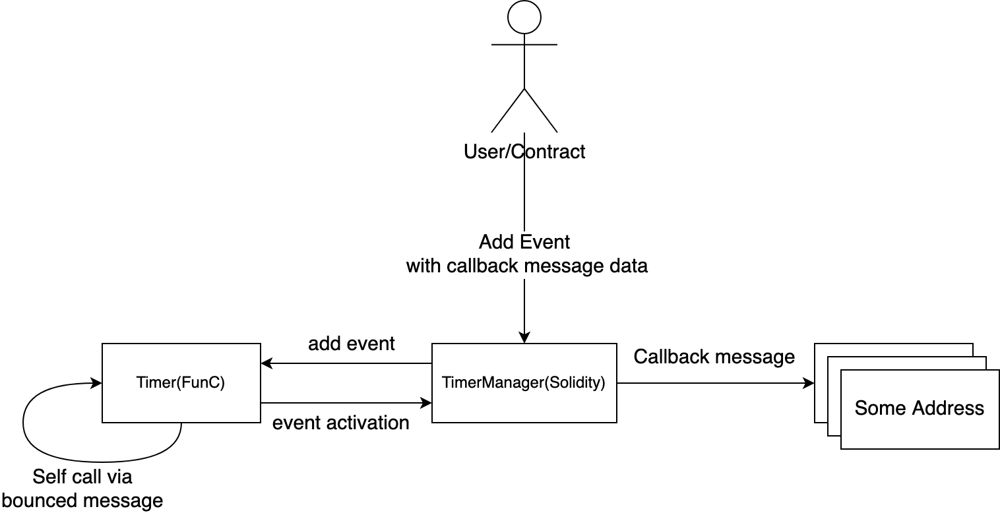

# Free TON on-chain Timer
## Overview
This timer consists of two contracts that work together, one written in Solidity, the other in low-level FunC. Solodity allowed for a simple user-friendly interface to control multiple timers, while FunC made it very economic Gas usage.
### Main features:
 - Allows you to create and manage many timers with different settings
 - One of the cheapest for usage on-chain timer realization: 
   - ~2 Token/Hour for **six** working timers(**48 Token/Day**)
   - ~1.5 Token/Hour for one timer(36 Token/Day)
 - Customizable timer: One-time event, repeat, schedule
 - Fully customizable callback message
 - User-friendly interface (ABI)
 - Can be used from another Solidity smart contracts
## Components and workflow


The timer consists of two contracts, TimerManager (Solidity) and Timer (FunC). User interacts only with TimerManager through its public methods. 

When deploying TimerManager, he himself deploys Timer with his own key.

TimerManager stores all information about installed timers and their callback messages, Timer stores only minimum information(eventId and eventTime) for price reduce.

When Timer has events that need to be processed, it creates a message to a non-existent address with a bounce flag, which will be returned and will restart the execution of the contract.

When the Timer has an event that needs to be executed, it creates a message on the TimerManager with the ID of this event, the TimerManager will receive this message and send the appropriate callback and set a new event on the Timer, if necessary.

## How to use
### Deploy via tonos-cli
```shell script
tonos-cli genphrase

tonos-cli getkeypair timer.keys.json "<seed_phrase_for_depool>"

tonos-cli genaddr src/TimerManager.tvc src/TimerManager.abi.json --setkey timer.keys.json --wc 0
``` 
Send Coins to the Calculated Address and deploy
```shell script
tonos-cli deploy src/TimerManager.tvc '{"timerCode": "'$(base64 src/timer-code.boc) -w 0'"}' --abi src/TimerManager.abi.json --sign timer.keys.json --wc 0
```
For macOS remove ``-w 0`` 
### Add new timer
Call ``addEvent`` method with params to add new timer event
```shell script
tonos-cli call *you-timer-adddress* addEvent *params* --abi src/TimerManager.abi.json --sign timer.keys.json
```
#### Parameters description
```j
"dest"(address)     - Destination address where the message will be sent on event activation
"value"(uint128)    - Amount of tokes(in nano) for outgoing message
"payload"(cell)     - Message payload
"bounce"(bool)      - Message bounce flag
"sendFlags"(uint16) - Message flags
"delay"(uint64)     - Delay in seconds between event activations, 0 if onetime event
"next"(uint64)      - Next time for event activation, set 0 for NOW + DELAY (must be not zero if one time event) 
```

- Create timer that will trigger every 60 seconds from NOW 
```json
{"dest": "0:123...", "value": 10000, "payload": "", "bounce": false, "sendFlags": 1, "delay": 60, "next": 0}
```
- Make one time event that will be activated at `1606160303 (11/23/2020 @ 7:38pm (UTC))`
```json
{"dest": "0:123...", "value": 10000, "payload": "", "bounce": false, "sendFlags": 1, "delay": 0, "next": 1606160303}
```
- Make timer that will be triggers at the beginning of every hour `**:00` starting from `11/24/2020 @ 12:00am (UTC`
```json
{"dest": "0:123...", "value": 10000, "payload": "", "bounce": false, "sendFlags": 1, "delay": 3600, "next": 1606176000}
```
### Get active timers
```shell script
tonos-cli run *you-timer-adddress* getEvents {} --abi src/TimerManager.abi.json
```
Example output
```
[{
  bounce: false,
  delay: '0x927c0',
  dest: '0:1234...',
  id: '0xe845f17c',
  last: '0x0',
  next: '0x5fc525cc',
  payload: 'te6ccgEBAQEAAgAAAA==',
  sendFlags: '0x1',
  value: '0x2710'
}]
```
### Remove timer by id
```shell script
tonos-cli run *you-timer-adddress* removeEvent '{"eventId": "0xe845f17c"}' --abi src/TimerManager.abi.json --sign timer.keys.json
```
### Pause all timers
```shell script
tonos-cli call *you-timer-adddress* stopPending {} --abi src/TimerManager.abi.json --sign timer.keys.json
```
### Resume paused timers
```shell script
tonos-cli call *you-timer-adddress* startPending {} --abi src/TimerManager.abi.json --sign timer.keys.json
```
### Replenish timer contract
```shell script
tonos-cli call *you-timer-adddress* replenishTimer '{"value": 10000000000}' --abi src/TimerManager.abi.json --sign timer.keys.json
```
## Build form sources 
### Compiling timer.fc contract
*You may need write absolute paths to files

Step 1: Compiling func code to fift file 
```shell script
ton/build/crypto/func -SPA -R -o timer-code.fif ton/crypto/smartcont/stdlib.fc timer.fc
```

Step 2: Assembling fift code of timer contract to binary 
```shell script
ton/build/crypto/fift -I ton/crypto/fift/lib:ton/crypto/smartcont -s timer-create-code.fif
```

Step 3: Encoding contract code to base64,   
```shell script
base64 timer-code-code.boc -w 0
```
---
### Author @get_username
